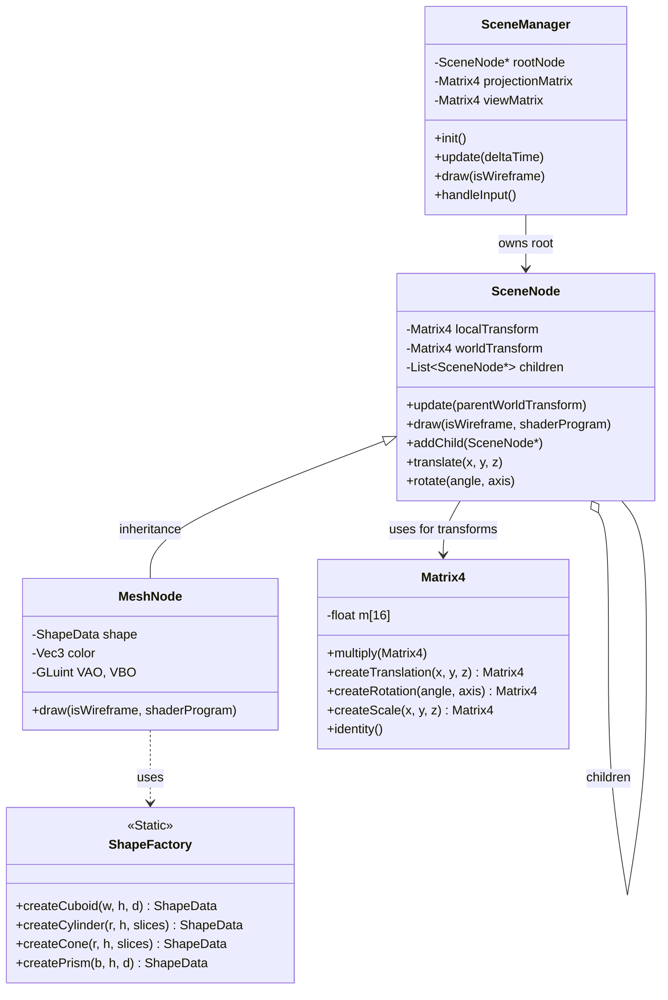
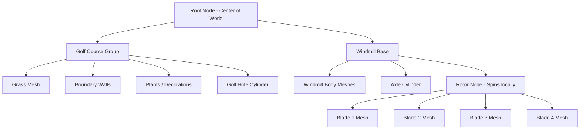

# Project Architectural Plan

Transitioning to a structured, object-oriented approach is a major step up and fits perfectly with advanced computer science coursework. Using the Composite pattern (Scene Graph) and the Factory pattern will separate your mathematical logic, geometry generation, and rendering pipeline, making the hierarchical transformations required for the windmill much easier to handle.

Here is the complete architectural plan, the files you will need, and the skeleton structures to get you started.

### 1. File Structure

You will want to separate your code into logical directories or at least distinct modules. Here are the files you will need:


**Core Math (No glm built-ins allowed)**
* `math/Matrix4.h` & `math/Matrix4.cpp`: Custom 4x4 matrix class for transformations.
* `math/Vector.h` & `math/Vector.cpp`: You can repurpose your Prac 2 vectors, expanding them to 3D and 4D for matrix multiplication.

**Scene Graph (Composite Pattern)**
* `scene/SceneNode.h` & `scene/SceneNode.cpp`: The base class for all objects in the scene.
* `scene/MeshNode.h` & `scene/MeshNode.cpp`: A leaf node that actually holds geometry and renders it.
* `scene/SceneManager.h` & `scene/SceneManager.cpp`: Manages the root node, user input states, and the main update/draw loop.

**Geometry Generation (Factory Pattern)**
* `geo/ShapeData.h`: A simple struct to hold vertex and index data.
* `geo/ShapeFactory.h` & `geo/ShapeFactory.cpp`: Static methods to generate the vertices for your cuboids, cylinders, cones, and prisms.

**Application Entry**
* `main.cpp`: Only handles GLFW window creation, OpenGL context, and instantiating the `SceneManager`.
* `shader.hpp` & `shader.cpp`: From your Prac 2.

### 2. Architecture Diagrams

#### Class Architecture (How the code relates)


#### Scene Graph Tree (How the 3D objects relate)
This shows how transformations cascade. If you rotate the Windmill Base, the Rotor and Blades automatically rotate with it. If you spin the Rotor, only the Blades spin with it.



### 3. Skeleton File Structures

Here are the structural outlines for the core files.


**math/Matrix4.h**
This is critical because you cannot use `glm` functions like `glm::translate` or `glm::rotate`.
```cpp
#ifndef MATRIX4_H
#define MATRIX4_H

#include "Vector.h"

class Matrix4 {
public:
	float m[16];

	Matrix4(); // Defaults to Identity matrix
    
	// Matrix Arithmetic
	Matrix4 operator*(const Matrix4& other) const;
	Vector<4> operator*(const Vector<4>& vec) const;

	// Transformation Generators
	static Matrix4 translate(float x, float y, float z);
	static Matrix4 rotate(float angleDegrees, const Vector<3>& axis);
	static Matrix4 scale(float x, float y, float z);
	static Matrix4 identity();
};

#endif
```

**geo/ShapeFactory.h**
Instead of building shapes dynamically in your draw loop, build them once here.
```cpp
#ifndef SHAPE_FACTORY_H
#define SHAPE_FACTORY_H

#include <vector>

struct ShapeData {
	std::vector<float> vertices; 
	// You can add indices here if you decide to use glDrawElements
};

class ShapeFactory {
public:
	static ShapeData createCuboid(float width, float height, float depth);
	// Slices must be >= 8 according to spec
	static ShapeData createCylinder(float radius, float height, int slices);
	static ShapeData createCone(float radius, float height, int slices);
	static ShapeData createTriangularPrism(float base, float height, float depth);
};

#endif
```

**scene/SceneNode.h**
The backbone of the Composite pattern.
```cpp
#ifndef SCENE_NODE_H
#define SCENE_NODE_H

#include <vector>
#include "../math/Matrix4.h"

class SceneNode {
protected:
	Matrix4 localTransform;
	Matrix4 worldTransform;
	std::vector<SceneNode*> children;

public:
	SceneNode();
	virtual ~SceneNode();

	void addChild(SceneNode* child);
    
	// Setters for transformations
	void setLocalTransform(const Matrix4& transform);
	Matrix4 getLocalTransform() const;

	// Cascades the matrix multiplication down the tree
	virtual void update(const Matrix4& parentWorldTransform);
    
	// Virtual draw method to be overridden by MeshNode
	virtual void draw(unsigned int shaderProgram, bool isWireframe);
};

#endif
```

**scene/MeshNode.h**
Inherits from `SceneNode`. This node actually talks to OpenGL.
```cpp
#ifndef MESH_NODE_H
#define MESH_NODE_H

#include "SceneNode.h"
#include "../geo/ShapeFactory.h"
#include "../math/Vector.h"

class MeshNode : public SceneNode {
private:
	unsigned int VAO, VBO;
	int vertexCount;
	Vector<3> baseColor;

	void setupBuffers(const ShapeData& data);

public:
	MeshNode(const ShapeData& shapeData, const Vector<3>& color);
	~MeshNode();

	// Overrides the base draw to send data to shaders
	void draw(unsigned int shaderProgram, bool isWireframe) override;
};

#endif
```


**main.cpp**
Your main file becomes much cleaner, focusing only on the application lifecycle.
```cpp
#include <GL/glew.h>
#include <GLFW/glfw3.h>
#include "scene/SceneManager.h"
#include "shader.hpp"

// GLFW initialization code here (startUpGLFW, startUpGLEW)...

int main() {
	GLFWwindow* window = setUp();
    
	GLuint progID = LoadShaders("simple.vert", "simple.frag");
    
	SceneManager sceneManager;
	sceneManager.buildScene(); // Uses ShapeFactory to create MeshNodes and attaches them to the root

	double lastTime = glfwGetTime();

	while (!glfwWindowShouldClose(window)) {
		double currentTime = glfwGetTime();
		double deltaTime = currentTime - lastTime;
		lastTime = currentTime;

		glClear(GL_COLOR_BUFFER_BIT | GL_DEPTH_BUFFER_BIT);

		// 1. Process Input (W,A,S,D rotations, translations, rotor speed)
		sceneManager.processInput(window, deltaTime);

		// 2. Update Scene Graph (Calculates all world matrices)
		sceneManager.update();

		// 3. Draw Scene Graph
		sceneManager.draw(progID);

		glfwSwapBuffers(window);
		glfwPollEvents();
	}

	// Cleanup...
	return 0;
}
```

This structure ensures that when you press `+` to spin the rotor, you simply update the `localTransform` of the Rotor node in your `SceneManager`. When `update()` is called, that rotation is multiplied by the Windmill Base's world transform, and the math resolves itself perfectly without complex coordinate tracking.
